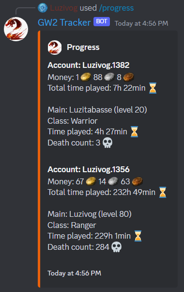

# Guild Wars 2 Discord Bot Tracker

## What is this?

This discord bot allows you to track the progress of you and your friends on guild wars 2. It was made using the [gw2 api v2](https://wiki.guildwars2.com/wiki/API:Main) and has 1 command, ``/progress``, that displays:



As you can see the bot uses custom emojis, you will need to add them to your discord server. They are available in the ``images`` folder. Make sure that you don't rename them.

## ⛓ Docker installation

You can use this discord bot as a Docker container. To do so, you need to [install Docker](https://www.docker.com/products/docker-desktop/) on your machine. Create a Discord bot and get the token, you can do so on the [discord developer portal](https://discord.com/developers/docs/intro). After, you will need to get your [guild wars 2 API key](https://account.arena.net/applications). Then, you can run the following command:

```sh
docker run -d -e "BOT_TOKEN=Your Discord Token" -e "API_KEYS=API_KEY_1,API_KEY_2,..." thediscorders/selfrythm
```

## ⛓ Manual installation
1) [Create a Discord bot](https://discord.com/developers/docs/intro) and get the token.
2) Clone the repository and navigate in the folder.
```
git clone https://github.com/Luzivog/gw2-Tracker.git
cd gw2-Tracker
```
3) Install all the modules with ``npm i``.
4) Fill in the file ``config.js`` with the bot token (step 1) and with your [guild wars 2 api key(s)](https://account.arena.net/applications).
5) Start the bot by doing ``npm start`` in a terminal in the folder.

## 👌 Usage

Add the bot to your server (official guide [here](https://discordjs.guide/preparations/adding-your-bot-to-servers.html#creating-and-using-your-invite-link)) and type ``/progress``!
